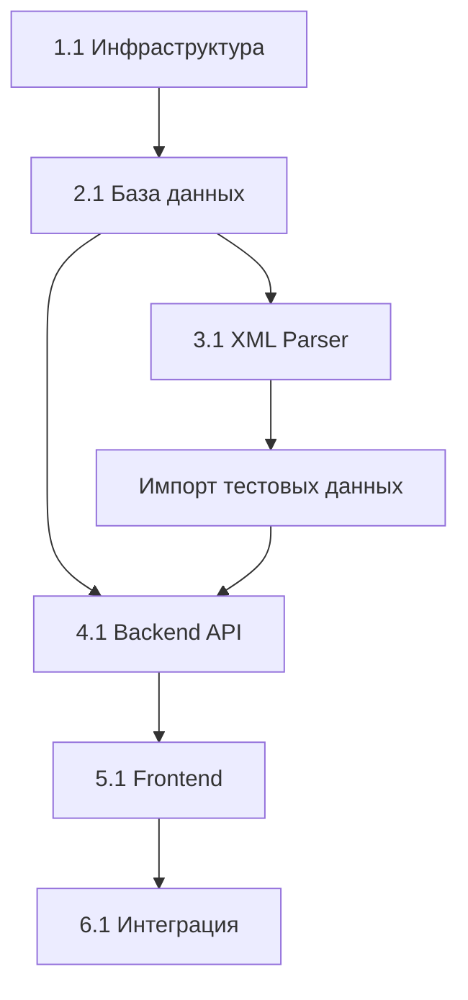

# Этап 1: MVP - Детальная декомпозиция задач

## Общая архитектура MVP

```
┌─────────────────────────────────────────────────────────────┐
│                         Frontend (React/Next.js)             │
│  ┌──────────────┐  ┌──────────────┐  ┌──────────────┐      │
│  │  Главная     │  │  Карточка    │  │  Карта       │      │
│  │  с фильтрами │  │  объекта     │  │  объектов    │      │
│  └──────────────┘  └──────────────┘  └──────────────┘      │
└──────────────────────────┬──────────────────────────────────┘
                           │ HTTP/REST API
┌──────────────────────────▼──────────────────────────────────┐
│                      Backend (Node.js/Express)               │
│  ┌──────────────┐  ┌──────────────┐  ┌──────────────┐      │
│  │  API Routes  │  │  Controllers │  │  Services    │      │
│  └──────────────┘  └──────────────┘  └──────────────┘      │
└──────────────────────────┬──────────────────────────────────┘
                           │
┌──────────────────────────▼──────────────────────────────────┐
│                    Data Layer                                │
│  ┌──────────────┐  ┌──────────────┐  ┌──────────────┐      │
│  │  PostgreSQL  │  │  Redis       │  │  File System │      │
│  │  + PostGIS   │  │  (cache)     │  │  (images)    │      │
│  └──────────────┘  └──────────────┘  └──────────────┘      │
└─────────────────────────────────────────────────────────────┘
                           ▲
                           │
┌──────────────────────────┴──────────────────────────────────┐
│                   XML Feed Parser (Cron Job)                 │
│  ┌──────────────┐  ┌──────────────┐  ┌──────────────┐      │
│  │  Download    │  │  Parse & Validate │  Import     │      │
│  └──────────────┘  └──────────────┘  └──────────────┘      │
└─────────────────────────────────────────────────────────────┘
```

---

## Блок 1: Инфраструктура и DevOps (Приоритет: Критический)

### 1.1 Настройка окружения разработки

**Задача 1.1.1:** Инициализация проекта
- [ ] Создать структуру каталогов проекта
  ```
  housler-pervichka/
  ├── backend/
  │   ├── src/
  │   │   ├── api/         # API routes
  │   │   ├── services/    # Business logic
  │   │   ├── models/      # Database models
  │   │   ├── parsers/     # XML parser
  │   │   ├── utils/       # Utilities
  │   │   └── config/      # Configuration
  │   ├── tests/
  │   ├── package.json
  │   └── tsconfig.json
  ├── frontend/
  │   ├── src/
  │   │   ├── components/  # React components
  │   │   ├── pages/       # Next.js pages
  │   │   ├── hooks/       # Custom hooks
  │   │   ├── services/    # API client
  │   │   ├── types/       # TypeScript types
  │   │   └── utils/       # Utilities
  │   ├── public/
  │   ├── package.json
  │   └── tsconfig.json
  ├── database/
  │   ├── migrations/      # DB migrations
  │   ├── seeds/           # Seed data
  │   └── schema.sql       # Initial schema
  ├── docker/
  │   ├── docker-compose.yml
  │   ├── Dockerfile.backend
  │   └── Dockerfile.frontend
  └── docs/
  ```
- [ ] Инициализировать Git репозиторий
- [ ] Создать `.gitignore` файлы
- [ ] Настроить EditorConfig
- **Время:** 2 часа
- **Критерии готовности:** Структура создана, Git инициализирован

**Задача 1.1.2:** Docker окружение
- [ ] Создать `docker-compose.yml` для разработки
  - PostgreSQL 14 с PostGIS
  - Redis 7
  - Node.js контейнер для backend
  - Node.js контейнер для frontend
- [ ] Создать `Dockerfile` для backend
- [ ] Создать `Dockerfile` для frontend
- [ ] Настроить volumes для hot-reload
- [ ] Настроить network между контейнерами
- [ ] Создать `.env.example` с переменными окружения
- **Время:** 4 часа
- **Критерии готовности:** `docker-compose up` запускает все сервисы

**Задача 1.1.3:** CI/CD pipeline (базовый)
- [ ] Настроить GitHub Actions для автотестов
- [ ] Настроить линтеры (ESLint, Prettier)
- [ ] Настроить pre-commit hooks (Husky)
- **Время:** 3 часа
- **Критерии готовности:** Автоматический прогон тестов при push

---

## Блок 2: База данных (Приоритет: Критический)

### 2.1 Создание схемы базы данных

**Задача 2.1.1:** Настройка PostgreSQL с расширениями
- [ ] Создать init-скрипт для установки расширений
  ```sql
  CREATE EXTENSION IF NOT EXISTS postgis;
  CREATE EXTENSION IF NOT EXISTS pg_trgm;
  CREATE EXTENSION IF NOT EXISTS btree_gist;
  ```
- [ ] Настроить подключение из backend
- [ ] Проверить работу PostGIS
- **Время:** 2 часа
- **Критерии готовности:** Расширения установлены, подключение работает

**Задача 2.1.2:** Создание базовых таблиц (справочники)
- [ ] Создать таблицу `districts`
  - id, name, region, created_at
  - Заполнить начальными данными (18 районов СПб)
- [ ] Создать таблицу `metro_stations`
  - id, name, line, coordinates, district_id
  - Добавить основные станции метро СПб
- [ ] Создать таблицу `developers`
  - id, name, inn, website, description
- [ ] Создать индексы
- **Файл:** `database/migrations/001_create_dictionaries.sql`
- **Время:** 3 часа
- **Критерии готовности:** Таблицы созданы, seed данные загружены

**Задача 2.1.3:** Создание основных таблиц
- [ ] Создать таблицу `complexes`
  - Все поля согласно schema.sql
  - GEOGRAPHY поле для координат
  - JSONB для инфраструктуры
- [ ] Создать таблицу `buildings`
  - Связь с complexes через foreign key
  - GEOGRAPHY поле для координат
- [ ] Создать таблицу `sales_agents`
  - Контактные данные агентов
- [ ] Создать индексы (GiST для географии, B-tree для основных полей)
- **Файл:** `database/migrations/002_create_main_tables.sql`
- **Время:** 4 часа
- **Критерии готовности:** Таблицы созданы, индексы на месте

**Задача 2.1.4:** Создание таблицы объявлений
- [ ] Создать таблицу `offers`
  - Все поля согласно schema.sql
  - GENERATED ALWAYS AS для price_per_sqm
  - CHECK constraints для валидации
  - GEOGRAPHY для координат
- [ ] Создать все необходимые индексы:
  - Составные индексы для фильтрации
  - GiST индекс для координат
  - GIN индекс для полнотекстового поиска
  - Partial индексы для is_active
- **Файл:** `database/migrations/003_create_offers.sql`
- **Время:** 5 часов
- **Критерии готовности:** Таблица создана, все индексы работают

**Задача 2.1.5:** Создание таблицы изображений
- [ ] Создать таблицу `images`
  - id, offer_id, tag, url, local_path
  - width, height, file_size
  - display_order
- [ ] Создать индексы
- [ ] Настроить CASCADE при удалении offer
- **Файл:** `database/migrations/004_create_images.sql`
- **Время:** 2 часа
- **Критерии готовности:** Таблица создана, связи работают

**Задача 2.1.6:** Триггеры и функции
- [ ] Создать функцию `update_updated_at_column()`
- [ ] Создать триггеры на offers, complexes, buildings
- [ ] Создать функцию `set_studio_flag()`
- [ ] Создать функцию `find_offers_nearby()` для геопоиска
- **Файл:** `database/migrations/005_create_triggers.sql`
- **Время:** 3 часа
- **Критерии готовности:** Триггеры работают автоматически

**Задача 2.1.7:** Система миграций
- [ ] Настроить node-pg-migrate или Knex.js
- [ ] Создать скрипты для миграций (up/down)
- [ ] Создать скрипт для сброса БД в dev окружении
- **Время:** 2 часа
- **Критерии готовности:** `npm run migrate` применяет миграции

---

## Блок 3: XML Parser (Приоритет: Критический)

### 3.1 Парсер XML-фидов

**Задача 3.1.1:** Настройка XML парсера
- [ ] Установить библиотеку (xml2js или fast-xml-parser)
- [ ] Создать базовую структуру парсера
  ```typescript
  class XMLFeedParser {
    async parseFeed(filePath: string): Promise<ParsedFeed>
    validateFeed(feed: any): ValidationResult
    extractOffers(feed: any): RawOffer[]
  }
  ```
- [ ] Настроить streaming для больших файлов
- **Файл:** `backend/src/parsers/XMLFeedParser.ts`
- **Время:** 4 часа
- **Критерии готовности:** Парсит тестовый XML файл

**Задача 3.1.2:** Маппинг XML → TypeScript типы
- [ ] Создать TypeScript интерфейсы для всех сущностей
  ```typescript
  interface RawOffer {
    internalId: string;
    type: string;
    propertyType: string;
    category: string;
    rooms: number;
    // ... все поля из XML
  }

  interface OfferLocation {
    country: string;
    region: string;
    district: string;
    address: string;
    coordinates: {lat: number; lng: number};
    metro?: MetroInfo;
  }
  ```
- [ ] Создать мапперы для трансформации данных
- **Файл:** `backend/src/types/offer.types.ts`
- **Время:** 3 часа
- **Критерии готовности:** Типизация покрывает все поля XML

**Задача 3.1.3:** Валидация данных
- [ ] Установить Zod или Yup для валидации
- [ ] Создать схемы валидации для каждой сущности
  ```typescript
  const OfferSchema = z.object({
    internalId: z.string(),
    price: z.number().positive(),
    area: z.number().positive(),
    coordinates: z.object({
      lat: z.number().min(-90).max(90),
      lng: z.number().min(-180).max(180)
    }),
    // ...
  });
  ```
- [ ] Обработка ошибок валидации
- [ ] Логирование невалидных записей
- **Файл:** `backend/src/parsers/validation.ts`
- **Время:** 4 часа
- **Критерии готовности:** Валидация отклоняет некорректные данные

**Задача 3.1.4:** Нормализация данных
- [ ] Создать утилиты для нормализации:
  - Телефонов (убрать пробелы, привести к +7XXXXXXXXXX)
  - Email (trim, toLowerCase)
  - Адресов (унификация сокращений: д., пр., ул.)
  - Цен (парсинг строк в числа)
  - Дат (ISO 8601 → Date)
- [ ] Расчет дополнительных полей:
  - price_per_sqm
  - living_area_percentage
  - kitchen_area_percentage
- **Файл:** `backend/src/parsers/normalizers.ts`
- **Время:** 4 часа
- **Критерии готовности:** Данные нормализованы перед сохранением

**Задача 3.1.5:** Импорт в БД (базовый)
- [ ] Создать сервис импорта
  ```typescript
  class ImportService {
    async importOffer(rawOffer: RawOffer): Promise<void>
    async importBuilding(building: Building): Promise<void>
    async importComplex(complex: Complex): Promise<void>
    async importImages(offerId: string, images: Image[]): Promise<void>
  }
  ```
- [ ] Реализовать upsert логику (UPDATE if exists, INSERT if not)
  - Проверка по internal-id
  - Обновление только если last-update-date новее
- [ ] Транзакции для целостности данных
- **Файл:** `backend/src/services/import.service.ts`
- **Время:** 6 часов
- **Критерии готовности:** Импорт одного offer работает корректно

**Задача 3.1.6:** Полный pipeline импорта
- [ ] Создать оркестратор импорта
  ```typescript
  class FeedImportOrchestrator {
    async importFeed(feedPath: string): Promise<ImportResult> {
      // 1. Parse XML
      // 2. Extract entities (complexes, buildings, agents)
      // 3. Import in correct order (deps first)
      // 4. Import offers
      // 5. Import images
      // 6. Log results
    }
  }
  ```
- [ ] Обработка ошибок (продолжить при ошибке на одном offer)
- [ ] Логирование прогресса (каждые 100 записей)
- [ ] Сохранение статистики импорта
- **Файл:** `backend/src/services/feed-import.orchestrator.ts`
- **Время:** 6 часов
- **Критерии готовности:** Полный фид импортируется успешно

**Задача 3.1.7:** CLI команда для импорта
- [ ] Создать CLI скрипт
  ```bash
  npm run import:feed -- --file=./data/spb.xml
  ```
- [ ] Прогресс-бар для визуализации
- [ ] Детальный лог успехов/ошибок
- [ ] Режим dry-run для тестирования
- **Файл:** `backend/src/cli/import-feed.ts`
- **Время:** 3 часа
- **Критерии готовности:** Импорт запускается из командной строки

**Задача 3.1.8:** Тестирование парсера
- [ ] Unit тесты для парсера (sample XML)
- [ ] Unit тесты для валидаторов
- [ ] Unit тесты для нормализаторов
- [ ] Integration тест полного импорта (100 записей)
- **Время:** 4 часа
- **Критерии готовности:** Покрытие тестами >80%

---

## Блок 4: Backend API (Приоритет: Высокий)

### 4.1 Базовая настройка API

**Задача 4.1.1:** Настройка Express сервера
- [ ] Установить зависимости (express, cors, helmet, compression)
- [ ] Создать основное Express приложение
  ```typescript
  import express from 'express';
  import cors from 'cors';
  import helmet from 'helmet';

  const app = express();
  app.use(helmet());
  app.use(cors());
  app.use(express.json());
  ```
- [ ] Настроить middleware (body-parser, cors, helmet)
- [ ] Обработка ошибок (error middleware)
- [ ] Логирование (winston или pino)
- **Файл:** `backend/src/server.ts`
- **Время:** 3 часа
- **Критерии готовности:** Сервер стартует, отвечает на /health

**Задача 4.1.2:** Настройка подключения к БД
- [ ] Установить pg (PostgreSQL client)
- [ ] Создать connection pool
  ```typescript
  import { Pool } from 'pg';

  export const pool = new Pool({
    host: process.env.DB_HOST,
    port: parseInt(process.env.DB_PORT || '5432'),
    database: process.env.DB_NAME,
    user: process.env.DB_USER,
    password: process.env.DB_PASSWORD,
  });
  ```
- [ ] Создать базовый Database service
- [ ] Graceful shutdown
- **Файл:** `backend/src/config/database.ts`
- **Время:** 2 часа
- **Критерии готовности:** Подключение к БД работает

**Задача 4.1.3:** Структура API роутов
- [ ] Создать роуты для основных эндпоинтов
  ```typescript
  /api/v1/offers         # Список объявлений
  /api/v1/offers/:id     # Детали объявления
  /api/v1/complexes      # Список ЖК
  /api/v1/complexes/:id  # Детали ЖК
  /api/v1/filters        # Доступные фильтры
  ```
- [ ] Настроить роутер
- [ ] Версионирование API (/v1/)
- **Файл:** `backend/src/api/routes/`
- **Время:** 2 часа
- **Критерии готовности:** Роуты зарегистрированы

### 4.2 Эндпоинт: Поиск объявлений

**Задача 4.2.1:** Query builder для фильтрации
- [ ] Создать OfferQueryBuilder
  ```typescript
  class OfferQueryBuilder {
    private query: string;
    private params: any[];

    filterByRooms(rooms: number[]): this
    filterByPrice(min?: number, max?: number): this
    filterByDistrict(districts: string[]): this
    filterByMetro(stations: string[], maxTime?: number): this
    filterByArea(min?: number, max?: number): this
    filterByFloor(min?: number, max?: number,
                  notFirst?: boolean, notLast?: boolean): this
    paginate(page: number, perPage: number): this
    sort(field: string, order: 'asc' | 'desc'): this

    build(): { query: string; params: any[] }
  }
  ```
- [ ] Динамическое построение WHERE условий
- [ ] Параметризованные запросы (защита от SQL injection)
- **Файл:** `backend/src/services/query-builder.service.ts`
- **Время:** 6 часов
- **Критерии готовности:** Поддержка всех основных фильтров

**Задача 4.2.2:** OffersService - бизнес-логика
- [ ] Создать OffersService
  ```typescript
  class OffersService {
    async searchOffers(filters: OfferFilters): Promise<PaginatedResult<Offer>>
    async getOfferById(id: string): Promise<Offer | null>
    async getOffersNearby(lat: number, lng: number,
                          radius: number): Promise<Offer[]>
  }
  ```
- [ ] Реализовать поиск с фильтрацией
- [ ] Подсчет total для пагинации
- [ ] Маппинг результатов из БД в DTO
- **Файл:** `backend/src/services/offers.service.ts`
- **Время:** 5 часов
- **Критерии готовности:** Поиск работает со всеми фильтрами

**Задача 4.2.3:** OffersController - HTTP обработчики
- [ ] Создать контроллер
  ```typescript
  class OffersController {
    async search(req: Request, res: Response): Promise<void>
    async getById(req: Request, res: Response): Promise<void>
    async getNearby(req: Request, res: Response): Promise<void>
  }
  ```
- [ ] Валидация query параметров (express-validator)
- [ ] Обработка ошибок
- [ ] Форматирование ответов (success/error)
- **Файл:** `backend/src/api/controllers/offers.controller.ts`
- **Время:** 4 часа
- **Критерии готовности:** Эндпоинт отвечает корректными данными

**Задача 4.2.4:** DTO (Data Transfer Objects)
- [ ] Создать DTO для ответов API
  ```typescript
  interface OfferListItemDTO {
    id: string;
    rooms: number;
    area: AreaDTO;
    floor: number;
    floorsTotal: number;
    price: PriceDTO;
    complex: ComplexShortDTO;
    location: LocationShortDTO;
    images: ImagesDTO;
    features: FeaturesDTO;
  }
  ```
- [ ] Мапперы DB model → DTO
- [ ] Оптимизация размера ответа (только нужные поля)
- **Файл:** `backend/src/api/dto/offer.dto.ts`
- **Время:** 3 часа
- **Критерии готовности:** DTO четко определены

### 4.3 Эндпоинт: Детали объявления

**Задача 4.3.1:** Получение полной информации об offer
- [ ] SQL запрос с JOIN всех связанных таблиц
  - offers + complexes + buildings + districts + metro + sales_agents
- [ ] Агрегация изображений (json_agg)
- [ ] Получение истории цен (опционально для MVP)
- **Файл:** `backend/src/services/offers.service.ts`
- **Время:** 3 часа
- **Критерии готовности:** Возвращает все данные об объекте

**Задача 4.3.2:** DTO для детального представления
- [ ] Создать OfferDetailDTO со всеми полями
- [ ] Вложенные объекты (building, complex, location)
- [ ] Форматирование дат, цен, телефонов
- **Файл:** `backend/src/api/dto/offer-detail.dto.ts`
- **Время:** 2 часа
- **Критерии готовности:** Полная структура данных

### 4.4 Эндпоинт: Список ЖК

**Задача 4.4.1:** ComplexesService
- [ ] Создать сервис для работы с ЖК
  ```typescript
  class ComplexesService {
    async getComplexes(filters: ComplexFilters): Promise<Complex[]>
    async getComplexById(id: number): Promise<ComplexDetail | null>
    async getComplexOffers(complexId: number,
                           filters: OfferFilters): Promise<Offer[]>
  }
  ```
- [ ] Агрегация статистики (min/max/avg цены)
- **Файл:** `backend/src/services/complexes.service.ts`
- **Время:** 4 часа
- **Критерии готовности:** Список ЖК со статистикой

**Задача 4.4.2:** ComplexesController
- [ ] Контроллер для ЖК
- [ ] Эндпоинты:
  - GET /api/v1/complexes
  - GET /api/v1/complexes/:id
  - GET /api/v1/complexes/:id/offers
- **Файл:** `backend/src/api/controllers/complexes.controller.ts`
- **Время:** 3 часа
- **Критерии готовности:** Эндпоинты работают

### 4.5 Эндпоинт: Фильтры (справочники)

**Задача 4.5.1:** FiltersService
- [ ] Получение доступных значений фильтров
  ```typescript
  class FiltersService {
    async getAvailableDistricts(): Promise<FilterOption[]>
    async getAvailableMetroStations(): Promise<FilterOption[]>
    async getBuildingTypes(): Promise<FilterOption[]>
    async getRenovationTypes(): Promise<FilterOption[]>
    async getPriceRange(filters?: OfferFilters): Promise<Range>
    async getAreaRange(filters?: OfferFilters): Promise<Range>
  }
  ```
- [ ] Подсчет количества объектов для каждого фильтра
- **Файл:** `backend/src/services/filters.service.ts`
- **Время:** 4 часа
- **Критерии готовности:** Возвращает все опции фильтров

**Задача 4.5.2:** Динамические диапазоны
- [ ] Расчет min/max цен с учетом текущих фильтров
- [ ] Расчет min/max площадей
- [ ] Кэширование результатов (Redis)
- **Время:** 3 часа
- **Критерии готовности:** Диапазоны обновляются динамически

### 4.6 Оптимизация и кэширование

**Задача 4.6.1:** Настройка Redis
- [ ] Подключение к Redis
- [ ] Создать Redis service
  ```typescript
  class CacheService {
    async get<T>(key: string): Promise<T | null>
    async set(key: string, value: any, ttl?: number): Promise<void>
    async del(key: string): Promise<void>
    async clear(pattern: string): Promise<void>
  }
  ```
- **Файл:** `backend/src/services/cache.service.ts`
- **Время:** 2 часа
- **Критерии готовности:** Redis работает

**Задача 4.6.2:** Кэширование запросов
- [ ] Кэширование списка фильтров (TTL: 1 час)
- [ ] Кэширование списков справочников (TTL: 1 день)
- [ ] Инвалидация кэша при обновлении данных
- **Время:** 3 часа
- **Критерии готовности:** Повторные запросы берутся из кэша

**Задача 4.6.3:** Тестирование API
- [ ] Unit тесты для сервисов
- [ ] Integration тесты для эндпоинтов
- [ ] E2E тесты основных сценариев
- **Время:** 6 часов
- **Критерии готовности:** Покрытие >70%

---

## Блок 5: Frontend (Приоритет: Высокий)

### 5.1 Настройка Next.js проекта

**Задача 5.1.1:** Инициализация проекта
- [ ] Create Next.js app с TypeScript
  ```bash
  npx create-next-app@latest frontend --typescript --tailwind --app
  ```
- [ ] Установить зависимости:
  - Tailwind CSS (или Material-UI / Ant Design)
  - React Query (для запросов к API)
  - Zustand (state management)
  - React Hook Form (формы)
  - Zod (валидация)
- [ ] Настроить TypeScript strict mode
- [ ] Настроить ESLint + Prettier
- **Время:** 3 часа
- **Критерии готовности:** Приложение запускается

**Задача 5.1.2:** Структура проекта и конфигурация
- [ ] Настроить path aliases (@/, @/components, @/services)
- [ ] Создать layout компонент (Header, Footer)
- [ ] Настроить Tailwind/UI библиотеку (темы, цвета)
- [ ] Создать конфигурацию API client
  ```typescript
  const API_BASE_URL = process.env.NEXT_PUBLIC_API_URL;
  ```
- **Время:** 2 часа
- **Критерии готовности:** Базовая структура готова

**Задача 5.1.3:** API Client
- [ ] Создать API client (axios или fetch wrapper)
  ```typescript
  class ApiClient {
    async get<T>(url: string, params?: any): Promise<T>
    async post<T>(url: string, data: any): Promise<T>
    // error handling, interceptors
  }
  ```
- [ ] Типизация всех эндпоинтов
- [ ] Обработка ошибок
- **Файл:** `frontend/src/services/api.ts`
- **Время:** 3 часа
- **Критерии готовности:** Запросы к backend работают

**Задача 5.1.4:** TypeScript типы (общие с backend)
- [ ] Создать types для всех DTO
  ```typescript
  export interface Offer {
    id: string;
    rooms: number;
    area: AreaInfo;
    price: PriceInfo;
    // ...
  }
  ```
- [ ] Можно использовать общий пакет или копировать
- **Файл:** `frontend/src/types/`
- **Время:** 2 часа
- **Критерии готовности:** Типизация всех данных

### 5.2 Главная страница поиска

**Задача 5.2.1:** Layout главной страницы
- [ ] Создать страницу `/` (app/page.tsx)
- [ ] Разметка:
  ```
  ┌─────────────────────────────────────┐
  │         Header (logo, menu)         │
  ├─────────────────────────────────────┤
  │     Форма фильтров (sticky)         │
  ├─────────────────────────────────────┤
  │  Результаты │  Карта (опционально)  │
  │             │                        │
  │  Карточки   │                        │
  │  объектов   │                        │
  └─────────────────────────────────────┘
  ```
- [ ] Адаптивный дизайн (mobile-first)
- **Время:** 4 часа
- **Критерии готовности:** Layout готов

**Задача 5.2.2:** Компонент: Форма фильтров (основные)
- [ ] Создать компонент FilterForm
  ```typescript
  interface FilterFormProps {
    onFilterChange: (filters: OfferFilters) => void;
    availableFilters: AvailableFilters;
  }
  ```
- [ ] Основные фильтры:
  - Количество комнат (чипы: Студия, 1, 2, 3, 4+)
  - Цена (range slider + инпуты)
  - Район (multi-select с поиском)
  - Метро (multi-select + время до метро)
- [ ] Управление состоянием (React Hook Form)
- [ ] Debounce для автоотправки
- **Файл:** `frontend/src/components/FilterForm.tsx`
- **Время:** 6 часов
- **Критерии готовности:** Фильтры работают, отправляют запросы

**Задача 5.2.3:** Компонент: Карточка объекта (список)
- [ ] Создать компонент OfferCard
  ```typescript
  interface OfferCardProps {
    offer: Offer;
    onFavoriteToggle?: (id: string) => void;
  }
  ```
- [ ] Отображение:
  - Главное фото (с fallback)
  - Цена + цена за м²
  - Кол-во комнат, площадь, этаж
  - Адрес, метро
  - Название ЖК
  - Кнопки: Избранное, Подробнее
- [ ] Hover эффекты
- [ ] Скелетон для загрузки
- **Файл:** `frontend/src/components/OfferCard.tsx`
- **Время:** 5 часов
- **Критерии готовности:** Карточка отображает все данные

**Задача 5.2.4:** Список результатов + пагинация
- [ ] Компонент OffersList
  ```typescript
  interface OffersListProps {
    offers: Offer[];
    loading: boolean;
    error?: Error;
    pagination: PaginationInfo;
    onPageChange: (page: number) => void;
  }
  ```
- [ ] Grid раскладка карточек (responsive)
- [ ] Пагинация (компонент Pagination)
- [ ] Скелетоны при загрузке
- [ ] Empty state (нет результатов)
- [ ] Error state
- **Файл:** `frontend/src/components/OffersList.tsx`
- **Время:** 4 часа
- **Критерии готовности:** Список с пагинацией

**Задача 5.2.5:** Интеграция с API (React Query)
- [ ] Создать хук useOffers
  ```typescript
  function useOffers(filters: OfferFilters) {
    return useQuery({
      queryKey: ['offers', filters],
      queryFn: () => apiClient.searchOffers(filters),
      keepPreviousData: true,
    });
  }
  ```
- [ ] Обработка состояний (loading, error, success)
- [ ] Автоматический рефетч при изменении фильтров
- **Файл:** `frontend/src/hooks/useOffers.ts`
- **Время:** 3 часа
- **Критерии готовности:** Данные подгружаются из API

**Задача 5.2.6:** Сортировка и счетчик результатов
- [ ] Компонент ResultsHeader
  - Счетчик: "Найдено 489 квартир"
  - Сортировка (dropdown): по цене, площади, дате
  - Переключатель вида: плитка/список
- [ ] Обработка изменения сортировки
- **Файл:** `frontend/src/components/ResultsHeader.tsx`
- **Время:** 3 часа
- **Критерии готовности:** Сортировка работает

### 5.3 Страница объекта

**Задача 5.3.1:** Layout страницы объекта
- [ ] Создать страницу `/offers/[id]`
- [ ] Разметка:
  ```
  ┌─────────────────────────────────────┐
  │         Галерея изображений         │
  ├─────────────┬───────────────────────┤
  │  Основная   │  Контакты             │
  │  инфо       │  Застройщика          │
  │             │                        │
  │  Описание   │  Похожие объекты      │
  ├─────────────┴───────────────────────┤
  │          Карта местоположения       │
  └─────────────────────────────────────┘
  ```
- **Время:** 3 часа
- **Критерии готовности:** Layout готов

**Задача 5.3.2:** Компонент: Галерея изображений
- [ ] Создать ImageGallery
  - Главное фото (большое)
  - Thumbnails (миниатюры)
  - Модальное окно для просмотра
  - Навигация (prev/next)
  - Группировка по типам (план, фото дома, план этажа)
- [ ] Lazy loading изображений
- [ ] Fallback для отсутствующих фото
- **Файл:** `frontend/src/components/ImageGallery.tsx`
- **Время:** 5 часов
- **Критерии готовности:** Галерея работает

**Задача 5.3.3:** Компонент: Основная информация
- [ ] Отображение всех характеристик:
  - Цена (большая), цена за м²
  - Комнаты, площади (общая/жилая/кухня)
  - Этаж, тип здания
  - Ремонт, балкон, санузел
  - Срок сдачи
- [ ] Красивое форматирование (иконки, цвета)
- [ ] Таблица характеристик
- **Файл:** `frontend/src/components/OfferDetails.tsx`
- **Время:** 4 часа
- **Критерии готовности:** Вся инфа отображается

**Задача 5.3.4:** Компонент: Блок с описанием
- [ ] Отображение description
- [ ] "Читать полностью" если текст длинный
- [ ] Разбивка на абзацы
- **Файл:** `frontend/src/components/OfferDescription.tsx`
- **Время:** 2 часа
- **Критерии готовности:** Описание читаемое

**Задача 5.3.5:** Компонент: Контакты
- [ ] Отображение контактов застройщика/агента
- [ ] Кнопки:
  - Позвонить (tel: ссылка)
  - Email (mailto: ссылка)
  - Записаться на просмотр (для MVP - просто alert)
- **Файл:** `frontend/src/components/ContactInfo.tsx`
- **Время:** 2 часа
- **Критерии готовности:** Контакты кликабельны

**Задача 5.3.6:** Интеграция с API
- [ ] Хук useOffer(id)
- [ ] SSR (Server-Side Rendering) для SEO
  ```typescript
  export async function generateMetadata({ params }) {
    const offer = await fetchOffer(params.id);
    return {
      title: `${offer.rooms}-комн. квартира ${offer.area} м² - ${offer.price}₽`,
      description: offer.description.substring(0, 160),
    };
  }
  ```
- [ ] Обработка 404 (объект не найден)
- **Время:** 3 часа
- **Критерии готовности:** Страница открывается по ID

### 5.4 Карта объектов (базовая интеграция)

**Задача 5.4.1:** Интеграция Yandex Maps API
- [ ] Подключить Yandex Maps API
  ```html
  <script src="https://api-maps.yandex.ru/2.1/?apikey=...&lang=ru_RU"></script>
  ```
- [ ] Создать компонент YandexMap (React wrapper)
- [ ] Отображение одного объекта на карте (страница объекта)
- **Файл:** `frontend/src/components/YandexMap.tsx`
- **Время:** 4 часа
- **Критерии готовности:** Карта показывает маркер объекта

**Задача 5.4.2:** Карта на главной странице (опционально для MVP)
- [ ] Отображение всех объектов из результатов поиска
- [ ] Кластеризация маркеров
- [ ] Popup с краткой инфой при клике
- [ ] Синхронизация с фильтрами
- **Время:** 6 часов
- **Критерии готовности:** Карта синхронизирована с поиском

### 5.5 UI/UX полировка

**Задача 5.5.1:** Адаптивность
- [ ] Проверка на мобильных устройствах
- [ ] Мобильная версия фильтров (drawer/modal)
- [ ] Touch-friendly элементы (кнопки >= 44px)
- **Время:** 4 часа
- **Критерии готовности:** Работает на всех экранах

**Задача 5.5.2:** Состояния загрузки
- [ ] Скелетоны для всех компонентов
- [ ] Спиннеры для долгих операций
- [ ] Smooth transitions
- **Время:** 3 часа
- **Критерии готовности:** Приятная загрузка

**Задача 5.5.3:** Обработка ошибок
- [ ] Error boundaries
- [ ] User-friendly сообщения об ошибках
- [ ] Retry кнопки
- **Время:** 2 часа
- **Критерии готовности:** Ошибки обрабатываются

---

## Блок 6: Интеграция и тестирование (Приоритет: Средний)

### 6.1 End-to-End тестирование

**Задача 6.1.1:** Настройка E2E тестов
- [ ] Установить Playwright или Cypress
- [ ] Настроить тестовое окружение
- [ ] Создать базовые тесты:
  - Открытие главной страницы
  - Фильтрация объектов
  - Открытие карточки объекта
  - Пагинация
- **Время:** 6 часов
- **Критерии готовности:** 5+ E2E тестов проходят

### 6.2 Документация

**Задача 6.2.1:** API документация
- [ ] Настроить Swagger/OpenAPI
- [ ] Документировать все эндпоинты
- [ ] Примеры запросов/ответов
- **Время:** 4 часа
- **Критерии готовности:** Swagger UI доступен

**Задача 6.2.2:** README и документация для разработчиков
- [ ] README.md с инструкциями по запуску
- [ ] Архитектурная диаграмма
- [ ] Описание основных компонентов
- **Время:** 3 часа
- **Критерии готовности:** Новый разработчик может запустить проект

---

## Зависимости задач (Critical Path)



**Критический путь:**
1. Инфраструктура (Docker, БД) - ДОЛЖНО быть первым
2. Схема БД - параллельно с парсером
3. XML Parser + импорт данных - нужны данные для тестирования
4. Backend API - зависит от БД и данных
5. Frontend - зависит от Backend API
6. E2E тесты - финальная проверка

---

## Оценка времени MVP

| Блок | Задач | Часов | Недель (40ч) |
|------|-------|-------|--------------|
| 1. Инфраструктура | 3 | 9 | 0.2 |
| 2. База данных | 7 | 21 | 0.5 |
| 3. XML Parser | 8 | 34 | 0.9 |
| 4. Backend API | 15 | 55 | 1.4 |
| 5. Frontend | 20 | 70 | 1.8 |
| 6. Тестирование | 2 | 10 | 0.3 |
| **ИТОГО** | **55** | **199** | **~5 недель** |

**С учетом буфера (+30%):** ~6-7 недель

---

## Чек-лист готовности MVP

### Функциональные требования
- [ ] Импорт XML фида в БД работает
- [ ] Поиск объектов с основными фильтрами
- [ ] Детальная страница объекта
- [ ] Карта на странице объекта
- [ ] Адаптивный дизайн (mobile + desktop)

### Технические требования
- [ ] Docker окружение запускается одной командой
- [ ] API документация (Swagger)
- [ ] Тесты (>70% покрытие backend)
- [ ] E2E тесты основных сценариев
- [ ] README с инструкциями

### Производительность
- [ ] Импорт фида < 5 минут
- [ ] API ответ < 500ms (p95)
- [ ] Страница загружается < 3 секунды

---

## Следующие шаги после MVP

1. **Этап 2:** Расширенные фильтры, сравнение, избранное
2. **Этап 3:** Аналитика, подписки, калькуляторы
3. **Оптимизация:** Elasticsearch, CDN для изображений, SSR
4. **Мониторинг:** Sentry, Google Analytics, метрики производительности
